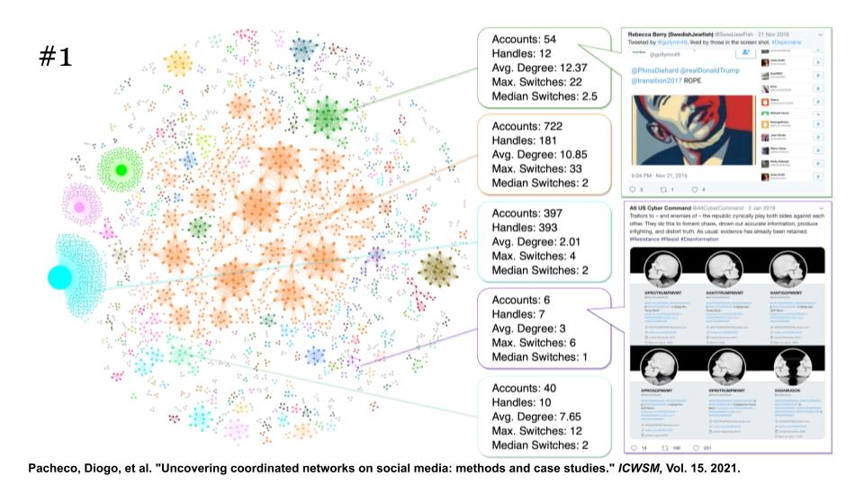
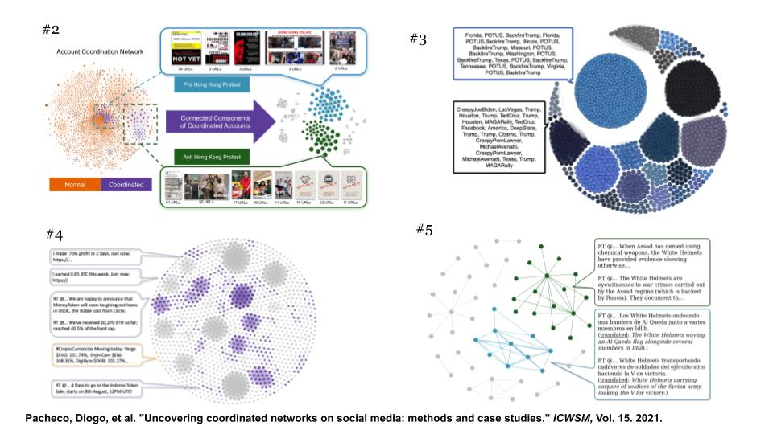

## Network tool
[link to Network tool](https://osome.iu.edu/tools/networks/)

- Overview 
- Sample queries: 
	- #roevwade , 06/21/2022 — 06/23/2022, hashtag co-occurence
	- #ukraine, 02/24/2023 — 02/25/2023, retweets & quotes, 
- Saving function

## Coordiscope 

[link to Coordiscope](https://osome.iu.edu/tools/coordiscope)

- References: 
    - [A language framework for modeling social media account behavior](https://epjdatascience.springeropen.com/articles/10.1140/epjds/s13688-023-00410-9
)
    - [Uncovering Coordinated Networks on Social Media] (https://ojs.aaai.org/index.php/ICWSM/article/view/18075/17878)
    
## TopFIBers
### What does a FIB index represent?

The FIB index is intended to capture the influence that a social media account has with respect to spreading low-credibility content. The FIB index focuses on problematic **repeat offenders** by capturing the consistency with which a user shares low-credibility content on a given platform during a period of time.
Repurpose the _h_-index, which was originally developed to measure the influence of scholars. 
- The _h_-index of a scholar is defined as the maximum value of _h_ such that they have at least _h_ papers, each with at least _h_ citations.
- Similarly, in the context of social media: a user with a FIB index of 100 means that the user has shared at least 100 posts linking to low-credibility sources, each of which has been reshared at least 100 times. On the other hand, a user who posts only one post linking to a low-credibility source will have a FIB index of one, even if it was reshared millions of times.

- References:
[Identifying and characterizing superspreaders of low-credibility content on Twitter](https://journals.plos.org/plosone/article?id=10.1371/journal.pone.0302201)

## Mastodon

[link to Mastodon tool](https://osome.iu.edu/tools/mastodon)

- First get your access token 
- Search by keywords: llm, academic, paper — mastodon.social
- Search by hashtags: palestine – mastodon.social